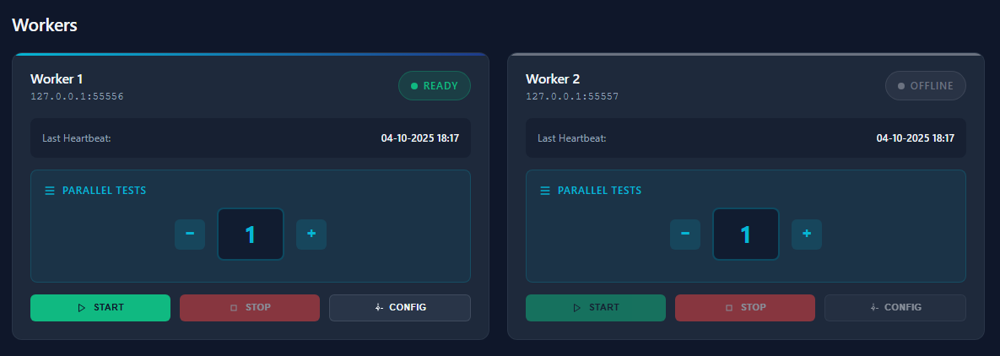

# Ox — Нагрузочное тестирование 1С


> Кроссплатформенный инструмент для нагрузочного тестирования веб-клиента 1С на базе Playwright


## 📋 Содержание

- [Введение](#введение)
- [Возможности и ограничения](#возможности-и-ограничения)
- [Установка](#установка)
- [Архитектура](#архитектура)
- [Быстрый старт](#быстрый-старт)
- [Создание тестовых сценариев](#создание-тестовых-сценариев)
- [Видео](#Видео-работы)
- [Отладка и диагностика](#Диагностика-проблем)


## Введение

**Ox** — это открытоисходный инструмент для нагрузочного тестирования веб-клиента 1С. Он позволяет эмулировать действия пользователей в веб клиенте и создавать нагрузку на тестируемую базу.

Проект создан на базе [Playwright](https://playwright.dev/) и предоставляет простой и удобный способ записи и воспроизведения пользовательских сценариев с поддержкой множественных параллельных исполнителей.

### Почему Ox?

В экосистеме открытого ПО отсутствует достойная альтернатива [Тест-центра](https://v8.1c.ru/tekhnologii/tekhnologii-krupnykh-vnedreniy/korporativnye-instrumenty/korporativnyy-instrumentalnyy-paket/test-tsentr/) для нагрузочного тестирования. Хотя **Ox** не претендует на полную замену Тест-центра (который предоставляет больше функций и возможностей), он компенсирует это **простотой использования**:

## Возможности и ограничения

### Что поддерживает Ox

- **Простая эксплуатация** — минимальная настройка и кривая обучения
- **Запись сценариев через UI** — как встроенный менеджер тестирования в 1С
- **Скриншоты и видео при ошибках** — автоматическая диагностика сбоев
- **Распределённое выполнение** — запуск множества worker'ов на разных машинах
- **Параллельные потоки** — настраиваемое количество одновременных тестов на worker'е
- **Панель управления** — веб-интерфейс для оркестрации и мониторинга
- **Выявление проблем** — логи worker'ов содержат подробную диагностику ошибок

### Ограничения

- **Только веб-клиент** — не поддерживает толстый, тонкий клиенты 1С
- **Упрощённый функционал** — по сравнению с Тест-центром
- **Зависит от Playwright** — используются возможности и ограничения браузерной автоматизации

## Установка

### Вариант 1: Из готовых бинарников

Скачайте последний релиз из [GitHub Releases](https://github.com/LazarenkoA/Ox/releases)

### Вариант 2: Сборка из исходников

**Требования:**
- [Go](https://go.dev/dl/) 1.21+

```bash
go build observer/cmd/observer/main.go
go build worker/cmd/worker/main.go
```

**Требования для worker'ов:**
- [Node.js](https://nodejs.org/en/download) 18+
- Playwright установится автоматически при первом запуске worker'а

## Архитектура

**Ox** состоит из двух компонентов:

### Worker

- **Описание:** Рабочий процесс, запускаемый на ВМ, с которой идёт нагрузка
- **Функция:** Выполнение Playwright сценариев в несколько потоков
- **Масштабирование:** Можно запускать множество экземпляров worker'ов
- **Требования:** Node.js, доступ к тестируемому веб-сервису 1С

### Observer

- **Описание:** Центральный оркестратор и панель управления
- **Функция:** Управление worker'ами, распределение сценариев, сбор результатов
- **Экземпляры:** Должен быть ровно один экземпляр
- **Требования:** Сетевой доступ ко всем worker'ам по TCP

## Быстрый старт

### Шаг 1: Запустить Worker

На машине, с которой будет идти нагрузка:

```bash
worker.exe -p 55556
```

**Доступные флаги:**
- `-p, --port` — порт для прослушивания


Можно запустить несколько экземпляров на разных портах:

```bash
worker.exe -p 55555 
worker.exe -p 55556 
worker.exe -p 55557 
```

### Шаг 2: Настроить Observer

Отредактируйте конфиг [observer/config.yaml](observer/config.yaml):

```yaml
app_port: 8091
workers:
   - addr: "127.0.0.1:55555"
   - addr: "127.0.0.1:55556"
   - addr: "127.0.0.1:55557"
```

### Шаг 3: Запустить Observer

```bash
observer.exe -c config.yaml
```

Observer запустит веб-сервер на `http://localhost:8091`

### Шаг 4: Проверить статус Worker'ов

Откройте в браузере `http://localhost:8091` и проверьте, что все worker'ы в статусе **READY**:



#### Устранение проблем с подключением

**Если worker'ы в статусе OFFLINE:**

1. Проверьте сетевую доступность:
   ```bash
   telnet <worker_host> <worker_port>
   # или
   nc -zv <worker_host> <worker_port>
   ```

2. Проверьте, что worker'ы запущены и слушают нужные порты:
   ```bash
   lsof -i :<port>  # macOS/Linux
   netstat -ano | findstr :<port>  # Windows
   ```

3. Проверьте firewall правила на машинах с worker'ами

4. Убедитесь, что в конфиге Observer правильно указаны IP-адреса и порты

## Создание тестовых сценариев

### Запись сценария с помощью Codegen

Используйте встроенный UI редактор Playwright:

```bash
npx playwright codegen http://localhost/bsp/ru_RU/
```

Откроется два окна:
- **Браузер** — для выполнения действий
- **Inspector** — для просмотра генерируемого кода

Выполняйте действия в браузере, они автоматически записываются как код.

Видео пример:
https://github.com/user-attachments/assets/b2bc618b-2997-4a6a-8c19-d70043e9eeb3


### Пример сгенерированного сценария

```javascript
import { test, expect } from '@playwright/test';

test('create_survey_template', async ({ page }) => {
    // Переход на систему и авторизация
    await page.goto('http://localhost/bsp/ru_RU/');
    await page.locator('#userName').fill('Администратор');
    await page.locator('#userName').press('Tab');
    await page.locator('#userPassword').fill('123');
    await page.locator('#userPassword').press('Enter');
    
    // Ожидание загрузки интерфейса
    await page.waitForLoadState('networkidle');
    
    // Навигация по меню
    await page.getByText('Анкетирование').click();
    await page.getByText('Шаблоны анкет').click();
    
    // Создание нового элемента
    await page.locator('[id="form4_ФормаСоздать"]').click();
    
    const name = randomString();
    await page.getByRole('textbox', { name: 'Наименование:' })
        .pressSequentially(name);

    await page.locator('[id="form5_Заголовок"] > .inputs').click();
    await page.locator('[id="form5_Заголовок"] > .inputs')
        .pressSequentially(randomString());
    
    // Сохранение
    await page.locator('[id="form5_ФормаЗаписатьИЗакрыть"]').click();
    
    // Удаление созданного элемента
    await page.locator('[id="grid_form4_Список"]')
        .getByText(name, { exact: true })
        .click({ button: 'right' });
    
    await page.locator('#popupItem4')
        .getByText('Пометить на удаление / Снять пометку')
        .click();
    
    await page.locator('#form6_Button0 a')
        .filter({ hasText: 'Да' })
        .click();
});

function randomString() {
    return Math.random().toString(36).substring(2, 10);
}
```

### Рекомендации при редактировании сценариев

1. **Используйте `.pressSequentially()` вместо `.fill()`** — для элементов с автодополнением и валидацией
2. **Добавляйте явные ожидания** — `await page.waitForLoadState('networkidle')`
3. **Используйте подробные селекторы** — избегайте селекторов, зависящих от порядка элементов
4. **Генерируйте уникальные данные** — используйте функции для создания случайных значений
5. **Обрабатывайте ошибки** — добавляйте проверки важных состояний

Полная документация: [Playwright Documentation](https://playwright.dev/docs/intro)

## Проверка и отладка сценариев

### Локальное тестирование в UI режиме

После записи сценария проверьте его работу:

```bash
cd playwright
npx playwright test ./tests/bsp.spec.js --project=chromium --ui
```

Откроется интерактивное окно, где можно:
- Запустить сценарий целиком или отдельные шаги
- Увидеть скриншот каждого шага
- Отследить выполнение с замедлением


### Просмотр отчётов

После выполнения тестов на worker'е, результаты находятся в:

```
<worker_dir>/playwright/playwright-report/index.html
```

Отчёт содержит:
- 📸 Скриншоты каждого шага
- 🎥 Видео выполнения (особенно полезно при ошибках)
- 📋 Список всех действий и их результатов
- ⏱️ Время выполнения каждого шага

### Распространённые проблемы

| Проблема | Решение |
|----------|---------|
| Элемент не найден | Проверьте селектор в DevTools браузера, используйте более специфичные селекторы |
| Timeout при ожидании | Увеличьте timeout: `await page.locator(...).click({ timeout: 30000 })` |
| Случайные падения | Добавьте явные ожидания загрузки: `await page.waitForLoadState('networkidle')` |
| Элемент скрыт за другим | Используйте scroll: `await page.locator(...).scrollIntoViewIfNeeded()` |
| Данные не совпадают при повторном запуске | Используйте генерацию уникальных данных для каждого прогона |

## Управление тестами из Observer'а

В веб-интерфейсе Observer'а вы можете:

1. **Выбрать worker** — на котором запустится тест
2. **Установить параллелизм** — количество одновременных потоков
3. **Загрузить сценарий** — выбрать подготовленный скрипт Playwright
4. **Запустить тест** — начать выполнение
5. **Мониторить статус** — просматривать результаты в реальном времени

### Интерпретация статусов

- **READY** — worker подключен и готов к работе
- **RUNNING** — выполняется тест
- **ERROR** — тест завершился с ошибкой (см. логи)
- **OFFLINE** — worker недоступен (проверьте сетевое соединение)

### Видео работы
https://github.com/user-attachments/assets/6b5f548f-06bd-4ad5-a199-10ccb4ecf539


## Диагностика проблем

### Логи Worker'а

Логи находятся в каталоге worker'а в формате `date time.log`


### Видео и скриншоты при сбое

Находятся в:
```
<worker_dir>/playwright/playwright-report/index.html
```

Видео особенно полезно для понимания того, что произошло перед ошибкой.

### Лицензия

Проект распространяется под лицензией [MIT license](LICENSE)

### Поддержка

Для сообщений об ошибках и вопросов используйте [GitHub Issues](https://github.com/LazarenkoA/ox/issues)